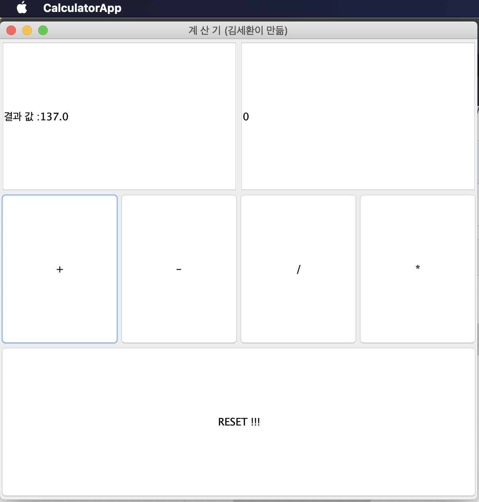

# 자바 프로그래밍 계산기 과제

* 우선은 계산기 기능을 담당할 Calculator 클래스를 구현
    - 계산기는 기본적인 사칙 연산이 가능해야 함
    - 버퍼 개념으로 이전 결과 값을 가지고, 리셋 가능한 인터페이스 구현 함

* Calculator.java 소스코드

```java

public class Calculator {
    double result_buffer;

    Calculator() {
        this.result_buffer = 0; // 계산기 생성시 버퍼 0으로 초기화.
    }
    public void show_result() {
        System.out.println(this.result_buffer);
    }

    public String return_str_buffer() {
        //Double.parseDouble(double1);
        //String.valueOf(dobule2);
        return String.valueOf(this.result_buffer);
    }

    public double return_buffer(){
        return this.result_buffer;
    }
    //reset은 단 2개의 인자만 더하기, 빼기, 나누기, 곱하기가 들어왔을 때 그 두 수만 계산한다고 생각하고 버퍼를 초기화 함
    // 하나의 인자만 넣었을 경우 기존 버퍼에 저장되어있는 값을 대상으로 계산한다고 생각하고 구현 함.
    public void reset(){
        this.result_buffer = 0;
        System.out.println("buffer reset!!");
    }

    // 인터페이스 개념. 누군가 계산기 버퍼에 어떤 값을 넣고 싶을때 멤버 변수에 직접 접근하는 것이 아닌, 메서드를 통해서 접근하도록.
    public void input_number(double x){
        this.result_buffer = x;
        this.show_result();
    }

    public void input_number(String x){
        this.result_buffer = Double.parseDouble(x);
    }

    public void plus(String x){
        this.result_buffer += Double.parseDouble(x);
        this.show_result();
    }

    public void plus(double x){
        this.result_buffer += x;
        this.show_result();
    }

    // 연산 기능들은 여러 인자들을 받을 수 있게 구현한다.
    public void plus(double ...dbs){
        this.reset();
        for (double d : dbs) {
            this.result_buffer += d;
        }
        this.show_result();
    }

    public void sub(String x){
        this.result_buffer -= Double.parseDouble(x);
        this.show_result();
    }

    public void sub(double ...dbs){
        this.reset();
        for (double d : dbs) {
            this.result_buffer -= d;
        }
        this.show_result();
    }

    public void sub(double x){
        this.result_buffer = this.result_buffer - x;
        this.show_result();
    }

    public void devide(String x){
        this.result_buffer = this.result_buffer / Double.parseDouble(x);
        this.show_result();
    }

    public void devide(double ...dbs){
        this.reset();
        for (double d : dbs){
            if(d == dbs[0]){
                this.result_buffer = d;
            }
        this.result_buffer = this.result_buffer / d;
        }
        this.show_result();
    }

    public void devide(double x, double y){
        this.reset();
        this.result_buffer = x / y;
        this.show_result();
    }

    //if just one argument given in devide -> do devide with result buffer
    public void devide(double x){
        if (x != 0.0){
        this.result_buffer = this.result_buffer / x;
        this.show_result();
        }
        else { // 0으로 나누려고 시도하는 상황을 try catch가 아닌 if 문으로 분기처리 함.
            System.out.println("error occured because you try to devicde number with 0!");
            this.result_buffer = 0;
        }

    }

    public void multiply(String x){
        this.result_buffer = this.result_buffer * Double.parseDouble(x);
        this.show_result();
    }

    public void multiply(double ...dbs){
        this.reset();
        for (double d : dbs){
            // 최초에 0번째 인덱스 값을 넣어준다 -> 버퍼를 처음에 0으로 초기화 했으니까!
            if (d == dbs[0]){
                this.result_buffer = d;
            }
            this.result_buffer *= d;
        }
        this.show_result();
    }
    // if just on argumnent  given in multiply -> do multiply with result buffer
    public void multiply(double x){
        this.result_buffer = this.result_buffer * x;
        this.show_result();
    }
}

```

이 계산기 클래스의 멤버 변수로는 result_buffer 를 float 형태로 하나만을 사용하며

생성자에서 0으로 초기화 하여 인스턴스를 만들도록 강제하였다.

메서드로는 더하기, 빼기, 곱하기, 나누기, 초기화, string 값 리턴 등의 메서드를 구현 했다.

실제 GUI 앱을 구현 할 때 사용하지 않을 기능들도 구현 함.

* 파이썬에서 사용하는 가변개수 인자가 자바에서도 최근에 구현되었다고 해서 사용함.

```python3

def test(*args, **kwargs){
    for _ in args:
        print(_);
}
```

하게 되면 가변개수의 args 인자들을 받을 수 있는데, 자바에서는

```java

   // 연산 기능들은 여러 인자들을 받을 수 있게 구현한다.
    public void plus(double ...dbs){
        this.reset();
        for (double d : dbs) {
            this.result_buffer += d;
        }
        this.show_result();
    }
```

`double ...dbs` 와 같이 구현 가능하다고 하여서 사용 함.


## GUI 앱 구현

* java swing 을 이용해서 구현 했다. 


* GUI 앱 코드

```java
package CalExam;

import javax.swing.*; // 스윙 컴포넌트들 사용하기 위해서
import java.awt.*; // 폰트 등 그래픽 처리를 위한 클래스들의 경로명
import java.awt.event.*; // 이벤트 처리에 필요한 기본 클래스들의 경로명
import javax.swing.event.*; // 스윙 이벤트 처리에 필요한 부분들
import java.awt.event.ActionEvent;
import java.awt.event.ActionListener;


public class CalculatorApp extends JFrame implements ActionListener
{
    Calculator cal = new Calculator(); // 구현한 계산기 인스턴스 생 ~ 성 
    JPanel textArea = new JPanel();
    JPanel operPad = new JPanel();
    JPanel reset = new JPanel();
    JButton btnPlus = new JButton("+");
    JButton btnSub = new JButton("-");
    JButton btnDiv = new JButton("/");
    JButton btnMul = new JButton("*");
    JButton btnReset = new JButton("RESET !!!");
    JTextField number = new JTextField(cal.return_str_buffer(), 20);
    JTextField result = new JTextField("결과 값 : ", 20);

    public CalculatorApp(){
        super("계 산 기 (김세환이 만듦)");
        setDefaultCloseOperation(JFrame.EXIT_ON_CLOSE);
        
        Container c = getContentPane();
        c.setLayout(new GridLayout(3,2));

        // 외부 클래스로 구현하면 이케하구, 근데 객체 전달 개념을 내가 잘 모르니까 그냥 
        // 내부 클래스에서 오버라이딩 해서 사용하는걸루 하자.. ㅜㅜ
        //MyActionListener listener = new MyActionListener(cal);

        btnPlus.addActionListener(this);
        btnSub.addActionListener(this);
        btnDiv.addActionListener(this);
        btnMul.addActionListener(this);
        btnReset.addActionListener(this);
        number.addActionListener(this);
        result.addActionListener(this);

        textArea.setSize(200,200);
        operPad.setLayout(new GridLayout(1,4));
        operPad.add(btnPlus);
        operPad.add(btnSub);
        operPad.add(btnDiv);
        operPad.add(btnMul);
        textArea.setLayout(new GridLayout(1,2));
        textArea.add(result);
        textArea.add(number);
        reset.setLayout(new GridLayout(1,1));
        reset.add(btnReset);

        c.add(textArea);
        c.add(operPad);
        c.add(reset);

        this.setSize(600,600);
        this.setVisible(true);
    }
    public static void main(String[] args){
        new CalculatorApp();
    } 
    
    //impletments 받은 Actionlisenter의 추상 메서드를 오버라이드해서, 커스텀 구현.
    @Override
    public void actionPerformed(ActionEvent e)
    {
        // 텍스트 필드에 숫자를 입력하는 이벤트 (엔터)가 발생 했을 시.
        if (e.getSource().equals(number))
        {
            JTextField t = (JTextField)e.getSource();
            cal.input_number(t.getText());
            number.setText("0");
            result.setText("결과 값 :" + cal.return_str_buffer());
            System.out.println(cal.return_str_buffer());
        }

        //더하기 버튼 눌렀을 때의 로직
        if (e.getSource().equals(btnPlus))
        {
            if (cal.return_str_buffer().equals("0.0") == true)
            {
                cal.input_number(number.getText());
                number.setText("0");
                result.setText("결과 값 :" + cal.return_str_buffer());
            }
            else if (cal.return_str_buffer().equals("0.0") != true)
            {
                cal.plus(number.getText());
                number.setText("0");
                result.setText("결과 값 :" + cal.return_str_buffer());
            }
        }

        //빼기 버튼을 눌렀을 때의 로직
        if (e.getSource().equals(btnSub))
        {
            if (cal.return_str_buffer().equals("0.0") == true)
            {
                cal.input_number(number.getText());
                number.setText("0");
                result.setText("결과 값 :" + cal.return_str_buffer());
            }
            else if (cal.return_str_buffer().equals("0.0") != true)
            {
                cal.sub(number.getText());
                number.setText("0");
                result.setText("결과 값 :" + cal.return_str_buffer());
            }
        }

        //곱하기 버튼을 눌렀을 때의 로직
        if (e.getSource().equals(btnMul))
        {
            if (cal.return_str_buffer().equals("0.0"))
            {
                cal.input_number(number.getText());
                number.setText("0");
                result.setText("결과 값 :" + cal.return_str_buffer());
            }
            else if (cal.return_str_buffer().equals("0.0") != true)
            {
                cal.multiply(number.getText());
                number.setText("0");
                result.setText("결과 값 :" + cal.return_str_buffer());
            }
        }

        //나누기 버튼을 눌렀을 때의 로직
        if (e.getSource().equals(btnDiv))
        {
            if (cal.return_str_buffer().equals("0.0"))
            {
                cal.input_number(number.getText());
                number.setText("0");
                result.setText("결과 값 :" + cal.return_str_buffer());
            }
            else if (cal.return_str_buffer().equals("0.0") != true)
            {
                cal.devide(number.getText());
                number.setText("0");
                result.setText("결과 값 :" + cal.return_str_buffer());
            }

            // 0으로 나누는 상황에 대한 예외처리를 위한 로직
            if ( Double.parseDouble(number.getText()) == 0 )
            {
                cal.reset();
                number.setText("0");
                result.setText("0으로 나누려고 시도했습니다. 계산기를 초기화 합니다.");
            }
        }

        //reset 로직
        if (e.getSource().equals(btnReset))
        {
            cal.reset();
            result.setText("계산기 초기화");
            number.setText("0");
        }
    }
    
}


// 이렇게 하면 객체 전달이 어려우니까 그냥 오버라이드 해서 하는걸로...(외부 클래스로 하지 않구..)
class MyActionListener implements ActionListener{
    Calculator superClass;
    MyActionListener(Calculator superClass){
        this.superClass = superClass;
    }
    public void actionPerformed(ActionEvent e){
        JTextField t = (JTextField)e.getSource();
        this.superClass.input_number(t.getText());
        System.out.println(this.superClass.return_str_buffer());
    }
}
```

* 우선 UI 구조는 모두 GridLayout으로 배치했다.

* 사실은 UI 모두 하나의 클래스로 구현하고, 이벤트 처리를 위한 핸들러(리스너)를 외부 클래스로 만들어서 적용하려고 했지만

* 외부 클래스에서 객체를 전달받는 부분이 현재 자바에 대한 이해도가 너무 떨어져서 구현이 불가능 하다고 판단했다 (시도는 해봤습니다 ㅠㅠ)

* 따라서 내부 클래스에서 ActionListener를 implement 하여, 추상 메서드를 오버라이드 해서 구현했다 (훨씬 간단하고 편하지만, 큰 프로젝트에선 적합하지 않을 것 같습니다.)


*실제 구현 화면*




