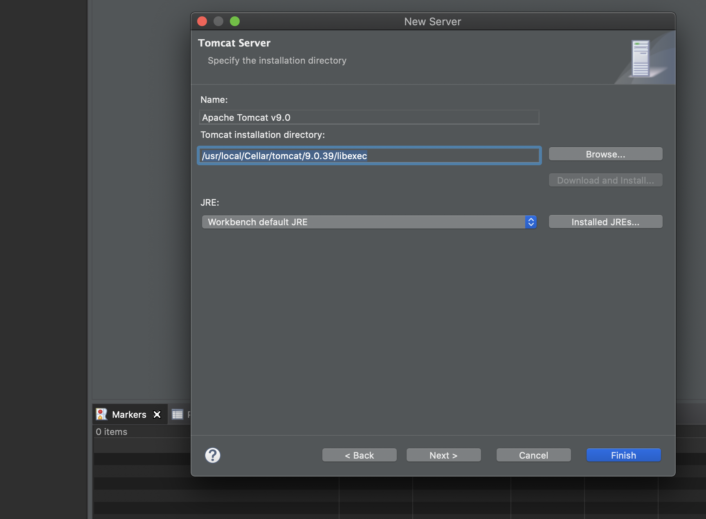
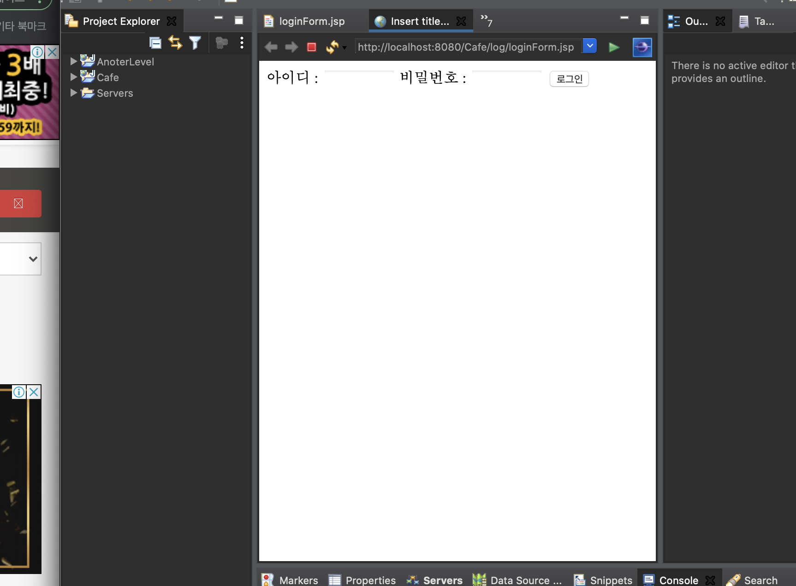

# JSP 맥에서 개발하기.

* brew를 이용해 tomcat 설치
    - 공식 홈페이지로 설치해도 좋지만 brew가있는데 굳이?

- JDK도 설치하시고.

- 개발은 이클립스에서 하기로 하자.

-  내 맥에 설치된 톰캣 위치는 `/usr/local/Cellar/tomcat/9.0.39/bin`

- 이클립스는 `Eclipse IDE for Enterprise Java Developers` 버전 설치. (vscode에 톰캣 서버 개발 방법 찾아봐야겠다)

> 내가 사용할 환경
- 톰캣 9.0.39
- JDK 11 (oracle)
- DB : MySQL or Postgresql.

Eclipse Enterprise 버전에서의 톰캣 연동 오류
- 분명 내 톰캣 bin 디렉터리는 `/usr/local/Cellar/tomcat/9.0.39/bin` 인데
- 프로젝트 생성시 저 경로를 넣으면 unknwon version of tomcat specifed라고 뜬다.

* 해결 방법 !!
    - `/usr/local/Cellar/tomcat/9.0.39/libexec` 와 같이 bin을 libexec으로 바꾼당 

* 간단한 로그인 구현

