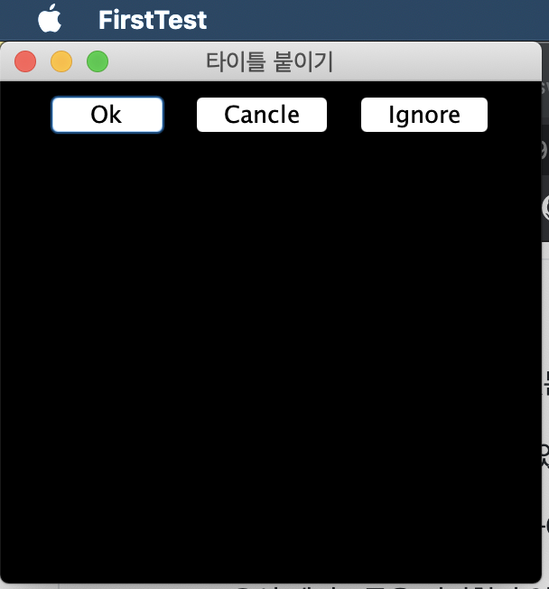
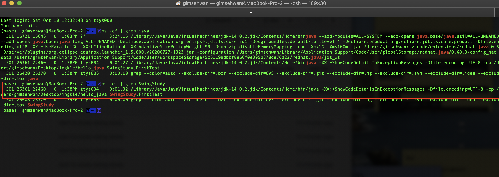
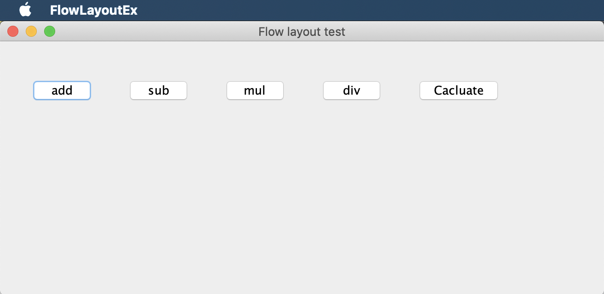
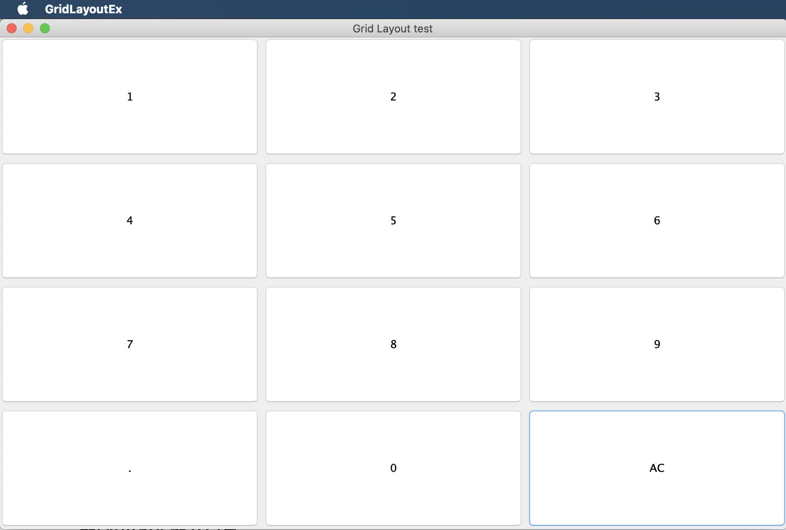
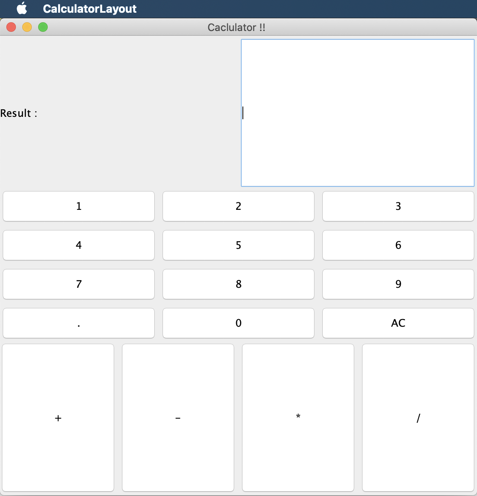

# JAVA 의 GUI 개발을 돕는 Swing에 대해서 공부하기

## 컨테이너와 컴포넌트

- 컨테이너는 다른 GUI를 포함 할 수 있는 컴포넌트임
- 컨테이너는 컴포넌트이자 동시에 컨테이너다.
- 컨테이너가 되기 위해서는 java.awt.Container 상속받아야 함.

```java
import java.awt.Container
```

- AWT 컨테이너 : Frame, Panel, Applet, Dialog, Window
- 스윙 컨테이너 : JFrame, JPanel, JApplet, JDialog, JWindow

- 컴포넌트
    - 컴포넌트는 다른 컴포넌트를 포함 할 수 없고, 컨테이너에 포함되어야 출력 된다
    - Component 클래스에는 모든 컴포넌트의 공통적인 속성과 기능이 작성되어 있음
    - 컴포턴트의 크기, 모양 등등에 관한 정보를 관리하는 멤버 변수와, 다양한 메서드를 제공함
    - 순수 스윙 컴포넌트는 javax.swing.Jcomponent를 상속받는다.

- 최상위 컨테이너
    - 컨테이너중에서 다른 컨테이너에 속하지 않고도 독립적으로 화면에 출력되는 컨테이너를 최상위 컨테이너라고 함
    - JFrame, JDialog, JApplet 이 세가지가 포함 된다.
    - 이를 제외한 나머지 컴포넌트들은 다른 컨테이너에 부착되어야 하고, 결국엔 최상위 컨테이너에 부착되어야 한다.


## 스윙 프레임가 컨텐트 팬

- 스윙 프레임은 모든 스윙 컴포넌트들을 담는 최상위 컨테이너다.
- 스윙 프레임이 출력 될 때 스윙 프레임 내에 부착된 모든 컴포넌트들이 화면에 출력된다.
- 컴포넌트들은 스윙 프레임 없이 독립적으로 화면에 출력 할 수 없다.


```java

import javax.swing.*; // 스윙 컴포넌트들 사용하기 위해서
import java.awt.*; // 폰트 등 그래픽 처리를 위한 클래스들의 경로명
import java.awt.event.*; // 이벤트 처리에 필요한 기본 클래스들의 경로명
import javax.swing.event.*; // 스윙 이벤트 처리에 필요한 부분들

public class FirstTest extends JFrame {
    public FirstTest() {
        setTitle("Swing Frame test");
        setSize(300, 300);
        setVisible(true);
    }
public static void main(String[] args){
    FirstTest frame = new FirstTest();
} 
}
```

이런식으로 하면 300x300 프레임이 출력된다. 이 예제에서는 프레임 클래스를 구현한 코드 안에 main 메서드를 만들어서 출력했지만, 내가 만들 구조는 이 프레임을 실행 시킬 코드를 분리할것이다.

* main 메서드는 무조건 간단하게, 무언가 중요한 로직이 안들어 가는 것이 swing기반 응용프로램에서 중요하다고 한다.


```java

package SwingStudy;

import javax.swing.*; // 스윙 컴포넌트들 사용하기 위해서
import java.awt.*; // 폰트 등 그래픽 처리를 위한 클래스들의 경로명
import java.awt.event.*; // 이벤트 처리에 필요한 기본 클래스들의 경로명
import javax.swing.event.*; // 스윙 이벤트 처리에 필요한 부분들


public class FirstTest extends JFrame {
    public FirstTest() {
        super("타이틀 붙이기"); // super() -> JFrame(title문자열) 생성자를 호출해서 다는 것 
        //setTitle("Swing Frame test"); super() 혹은 setTitle 둘다 동일함
        setDefaultCloseOperation(JFrame.EXIT_ON_CLOSE);

        Container contentPane = getContentPane(); // 컨텐트 팬을 알아내는 로직
        contentPane.setBackground(Color.BLACK); // 배경 색 검은색으로
        contentPane.setLayout(new FlowLayout());

        contentPane.add(new JButton("Ok"));
        contentPane.add(new JButton("Cancle"));
        contentPane.add(new JButton("Ignore"));

        setSize(300, 300);
        setVisible(true);
    }
public static void main(String[] args){
    FirstTest frame = new FirstTest();
} 
}

```



- 출력 화면
- contentPane을 알아내고, 여기에 세개의 버튼을 순서대로 붙인 화면이다.


```java
       setDefaultCloseOperation(JFrame.EXIT_ON_CLOSE);
```

이 부분을 추가해야 GUI 앱에서 종료 버튼을 눌렀을 때 실제로 프로세스가 죽는다.



실제로 setDefaultCloseOperation(JFRAME.EXIT_ON_CLOSE); 코드를 삽입 하지 않으면

GUI 앱 프로세스가 죽지 않는다. 테스트 해보니까 실제로 ps -ef | grep 내 프로그램 이름
이용해서 프로세스 상태 확인해봤더니 진짜 그렇다!


* 왜 main() 메소드가 종료한 이후에도 프레임이 살아있을까?
    - 콘솔 응용프로그램을 여태 만들었을 때는 자바 프로그램을 실행하면 main 스레드를 만들고, main() 을 실행시켰다.
    - main() 종료하면 스레드도 종료되고 프로그램이 종료되었었다.
    - JFrame 객체가 생성되면 main 스레드 외에도 Event Dispatch Thread(이벤트 분배 스레드)가 자동으로 생성되고, main 스레드가 종료되어도 저 스레드가 살아있어서 프로그램이 종료되지 않고 사용자의 입력을 계속 받을 수 있는 상태가 되는거란다.

## 컨테이너와 배치

- 컨테이너와 배치 개념
    - 컨테이너에 부착되는 컴포넌트들의 위치와 크기는 컨테이너 내부에 있는 배치관리자(Layout Manager) - Batch가 아님에 주의 - 에 의해 결정된다.
    
    - 컨테이너마다 배치 관리자가 하나씩 있다.
    - 배치관리자는 컨테이너에 컴포넌트가 부착되는 시점에 컴포넌트의 위치와 크기을 결정한다.

- 배치 관리자의 종류
    - FlowLayout 
        - 컨테이너에 부착되는 순서대로 왼쪽에서 오른쪽으로 컴포넌트를 배치하며, 오른쪽에 더이상 배치할 공간이 없으면 아래쪽으로 내려와서 다시 똑같은 순서로 배치한다.
    -  BoderLayout
        - 컨테이너의 공간을 동, 서, 남, 북 , 중앙의 총 5개의 영역으로 나눈다
        - 응용 프로그램에서 지정한 영역에 컴포넌트를 배치한다.
        - 지정하지 않으면 중앙에 배치된다
    - GridLayout
        - 컨테이너의 공간을 응용프로그램에서 설정한 동일한 크기의 2차원 격자로 나누고, 컴포넌트가 삽입되는 순서대로 좌에서 우, 위에서 아래로 배치한다.
        - 컴포넌트의 크기는 셀의 크기와 동일하게 설정한다.

- 컨테이너에 새로운 배치 관리자 설정 setLayout() 메서드

```java

Container.setLayout(LayoutManager lm); // lm을 새로운 레이아웃 매니저로 설정한다

```

예를들어서 JPanel에 BorderLayout 배치 관리자를 설정하려면

```java
JPanel p = new JPanel();
p.setLayout(new BoderLayout()); // 패널에 Boder layout 배치 관리자를 설정
```

만약 컨텐트 팬에 배치 관리자를 Flow layout으로 설정하려면

```java
Container contentPane = frame.getContentPane(); // 프레임의 컨텐트 팬
contentPane.setLayout(new FlowLayout());
```

new를 붙여주는 것 꼭 기억할것


```java

package SwingStudy;

import javax.swing.*; // 스윙 컴포넌트들 사용하기 위해서
import java.awt.*; // 폰트 등 그래픽 처리를 위한 클래스들의 경로명
import java.awt.event.*; // 이벤트 처리에 필요한 기본 클래스들의 경로명
import javax.swing.event.*; // 스윙 이벤트 처리에 필요한 부분들


public class FlowLayoutEx extends JFrame {
    public FlowLayoutEx(){
        super("Flow layout test");
        setDefaultCloseOperation(JFrame.EXIT_ON_CLOSE);
        Container c = getContentPane();

        c.setLayout(new FlowLayout(FlowLayout.LEFT, 30, 40));
        c.add(new JButton("add"));
        c.add(new JButton("sub"));
        c.add(new JButton("mul"));
        c.add(new JButton("div"));
        c.add(new JButton("Cacluate"));

        setSize(300, 200);
        setVisible(true);
    }

    public static void main(String[] args) {
        new FlowLayoutEx();
    }

}

```

FlowLayout.LEFT는 왼쪽부터 정렬, 30, 40은 gap (패딩같은?) 걸 의미함.




* Grid Layout 예시

```java
package SwingStudy;

import javax.swing.*; // 스윙 컴포넌트들 사용하기 위해서
import java.awt.*; // 폰트 등 그래픽 처리를 위한 클래스들의 경로명
import java.awt.event.*; // 이벤트 처리에 필요한 기본 클래스들의 경로명
import javax.swing.event.*; // 스윙 이벤트 처리에 필요한 부분들


public class GridLayoutEx extends JFrame{
    public GridLayoutEx(){
        super("Grid Layout test");
        setDefaultCloseOperation(JFrame.EXIT_ON_CLOSE);
        Container c = getContentPane();

        c.setLayout(new GridLayout(4,3, 5, 5));// 첫 두번쨰 숫자는 행개수, 열개수, 그 뒤 두개는 패딩
        c.add(new JButton("1"));
        c.add(new JButton("2"));
        c.add(new JButton("3"));
        c.add(new JButton("4"));
        c.add(new JButton("5"));
        c.add(new JButton("6"));
        c.add(new JButton("7"));
        c.add(new JButton("8"));
        c.add(new JButton("9"));
        c.add(new JButton("."));
        c.add(new JButton("0"));
        c.add(new JButton("AC"));

        setSize(300,300);
        setVisible(true);

    }
    public static void main(String[] args){
        new GridLayoutEx();
    }
}

```



```java
GridLayout(4, 3, 5, 5);
```

이 부분에서 앞에 두 수자는 행과 열, 뒤 두 숫자는 각 셀간의 여유 공간 (상하)를 의미함!!


* 배치 관리자가 없는 컨테이너 (절대 위치를 정할 때 ?)

- 배치 관리자 없는 컨테이너가 필요 한 경우

```java
container.setLayout(null); // 컨테이너의 배치 관리자 제거)

//예제 코드

Jpanel p = new JPanel();
p.setLayout(null);
```

이 때 컴포넌트들을 부착하면 기본 사이즈가 0 x 0으로 지정되어 보이지 않는다구 함

```java
void setSize(int width, int height) // 컴포넌트를 width x height 크기로 설정
void setLocation(int x, int y) // 컴포넌트의 왼쪽 상단 모서리 좌표를 x, y로 설정
void setBounds(int x, int y, int width, int height) // 크기와 위치 동시에 설정

// 예제 코드

Panel p = new JPanel();
p.setLayout(null);

JButton clickButton = new JButton("CLick");
clickButton.setSzie(100,40);
clickButton.setLocation(50, 50);
p.add(clickButton);
```


## 지금까지 구현 해 본 간단한 계산기 레이아웃




## Event 처리 부분은 더 공부해야 할듯.. 지금까지 구현 한 내용

- 우선 Action Handler를 커스텀화 해서 작업 해야 하는 듯

```java

///below line are Action Listener Logics...
class MyActionListener implements ActionListener{
    Calculator cal;
    MyActionListener(Calculator cal) {
        this.cal = cal;
    }
    public void actionPerformed(ActionEvent e){
        JButton b = (JButton)e.getSource();
        String tmp_buffer;
        tmp_buffer = b.getText();
        System.out.println(tmp_buffer);
        cal.input_number(tmp_buffer);
        System.out.println(cal.return_str_buffer());
    }
}

class MyResultActionListener implements ActionListener{
    Calculator cal;
    MyResultActionListener(Calculator cal) {
        this.cal = cal;
    }
    public void actionPerformed(ActionEvent e){
        JButton l = (JButton)e.getSource();
        l.setText(cal.return_str_buffer());
    }
}
```

- 생성자에 cal을 넣은 이유는, Layout을 그려 낼 때 게산 로직을 위한 Calculator 클래스가 생성되고, 오직 하나의 계산기 인스턴스를 가지고 계산 하기 위해서 전달 -> 전달 함.

- 지금 어려운 부분이 ActionListener 의 동작 원리는 대충 알겠으나. 
- 계산기 로직을 바꿔야 할 수 도 있다는 생각이 들어서 우선 내일 다시 하기 (10/11)