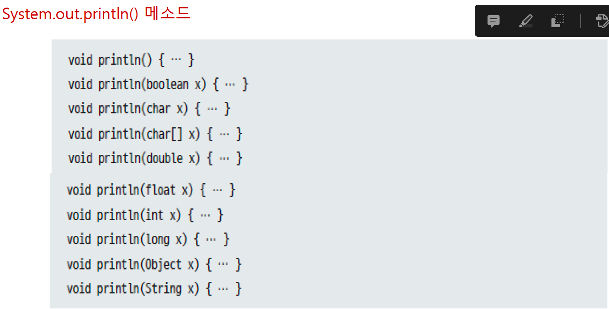

# 객체 지향

* 객체
    - 물리적으로 존재하거나 추상적으로 생각할 수 있는 것 중에서 자신의 속성을 가지며 식별 가능한 것
    - 속성 (field) + 동작 (method)로 구성

* 객체와 객체 간의 상호작용
    - 메소드를 통해 객체들이 상호작용
    - 메소드 호출 : 객체가 다른 객체의 기능을 이용하는 것


* 클래스
    - 자바의 설계도
    - 인스턴스 : 클래스로부터 만들어진 객체
    - 객체 지향 프로그래밍 단계
        - 클래스 설계 -> 설계된 클래스로 사용할 객체 생성 -> 객체 이용
    
* 클래스로부터 객체를 생성

``` java
new 클래스();
```

- new 연산자로 메모리 힙 영역에 객체 생성
- 객체 생성 후 객체 번지가 리턴
    - 클래스 변수에 저장하여 변수 통해 객체 사용 가능


* 클래스의 두가지 용도
    - 라이브러리 (API) 클래스
        - 객체 생성 및 메소드 제공 역할
    - 실행 클래스
        - main 메소드 제공 역할


```java

public class ClassExample {
    int fieldName; // 클래스의 필드
    // 객체의 데이터가 저장되는 곳

    ClassExample() {
        // 생성자
        // 객체 생성시 초기화 역할 담당
    }

    void methodName() {
        // 클래스의 메서드. 객체명.methoName() 과 같이 접근
        // 클래스명.methodName() 과 같이 접근하는건 정적 메서드(클래스 메서드) 참고
        // void는 해당 메서드의 리턴이 없다는 것을 뜻함
    }
}

```

## 필드 선언, 필드 사용

- 필드
    - 객체의 고유 데이터
    - 객체가 가져야 할 부품
    - 객체의 현재 상태 데이터등을 저장

- 필드 선언
    - 클래스 중괄호 블록 어디서든 존재 가능
    - 생성자와 메소드 중괄호 블록 내부에는 선언 불가
    - 변수와 선언 형태 유사하나 변수 아님에 주의

```java
public class Test {
    int a;
    String b = "hello";

}

```

- 파이썬은 ?

```python3

class Test:
    count = 0 #클래스 변수, 이 클래스를 통해 찍어낸 인스턴스는 모두 이 값으로 처음 생성
    def __init__(self, *args): #생성자
        self.name = args[0] #self 가 붙으면 인스턴스 변수들, 객체마다 다른 값
        self.age = args[1]
        self.lifeCycle = 0
    
    def test_method(self):
        self.old = self.lifeCycle
```

- 초기값은 주어질 수도, 생략할 수도 있음
    - 초기값 지정되지 않은 필드는 객체 생성 시 자동으로 기본 초기값 설정

* 필드 사용
    - 필드 값 읽고 변경하는 작업
    - 클래스 내부 생성자 및 메소드에서 사용하는 경우 :  필드 이름 읽고 변경
    - 클래스 외부에서 사용하는 경우 : 클래스로 부터 객체 생성한 뒤 필드 사용

```java

public class Car {
    String company = "현대";
    int speed;
}
```

```java
public class CarExample {
    public static void main(String[] args) {
        Car myCar = new Car(); //myCar라는 인스턴스(객체) 하나 생성
        myCar.speed = 50; // 객체의 필드값 변경
    }
}
```

- 파이썬 예
```python3

class Car:
    speed = None

if __name__ == "__main__":
    a = Car()
    a.speed = 30
```

## 생성자, 매개 변수, 객체 초기화, 오버로딩 ,this()

- 생성자
    - 클래스로부터 new 연산자로 객체를 생성할 때 호출되어 객체의 초기화를 담당

- 객체 초기화
    - 필드를 초기화 하거나 메소드를 호출해 객체를 사용할 준비를 하는 것

- 클래스에서 생성자 선언하지 않아도 new 생성자()로 객체 생성 가능


```java
public class Car {
    Car(String model, String color, int maxSpeed){ }
}
```

```java
Car myCar = new Car("그랜저", "검정", 300);
```

- 파이썬

```python3
class Car:
    def __init__(self, model, color, maxSpeed):
        self.modle = model
        self.color = color
        self.maxSpeed = maxSpeed

if __name__ == "__main__":
    myCar = Car("그랜저", "검정", 300)
```


* 생성자의 필드 초기화

```java
public class Korean {
    String nation = "대한민국";
    String name;
    String ssn;

    public Korea(String n, String s) {
        name = n;
        ssn = s;
    }
}

Korean k1 = new Korean("하이", "960316-1234567");
```
* 매개 변수 이름은 필드 이름과 유사하거나 동일한 것 사용 권장
* 필드와 매개 변수 이름 완전히 동일할 경우 this.필드로 표현

```java
public Korean(String name, String ssn) {
    this.name = name
    this.ssn = ssn
}
```


* 생성자 오버로딩(Overloading)
    - 매개 변수를 달리하는 생성자 여러개 선언
    - 외부에서 제공되는 다양한 데이터를 사용하여 객체 화 하기 위해

```java

public class Test {
    private int speed;

    Test(String speed){ //생성자
        this.speed = Integer.parseInt(speed);
    }

    Test(int speed) { //생성자를 다른 매개변수 타입으로 -> 생성자 오버로딩
        this.speed = speed
    }
    //생성자 오버로딩은 매개 변수의 타입, 개수, 순서를 다르게 선언해야 함
}
```

- 파이썬에 이런게 있을까?
    - 자바도 최근부터 지원하지만, 파이썬의 함수는 가변인자를 받을 수 있다.

```python3

class Test:
    def __init__(self, *args, **kwargs):
        print(args)
        print(kwargs)
# *args와 **kwargs의 차이? args는 각 인자별로 들어오고, kwargs는 keyword args로, 딕셔너리 형태로 입력하게 된다

# 이러한 가변인자 기능이 있기 때문에 오버로딩이 굳이 필요하지 않아 보인다.
```

```python3

def test(x, *args):
    pass 
test(1, 2, 3, 4)
# x -> 1, args = (2,3,4)

def test(x, y, **kwargs):
    pass

test(2, 3, flag=True, mode='fast', header='debug')
#x -> 2, y -> 3 , kwargs = { 'flag': True, 'mode': 'fast', 'header': 'debug' }

```

이런 강력한 가변인자 기능이 있기 때문에 오버로딩 ㄴㄴ


- 자바에서 생성자 오버로딩 예시 더 보기

```java
public class Car {
    Car() { } // Car car1 = new Car();
    Car(String model) { } // Car car2 = new Car("K3");
    Car(String model, String color) { } // Car car3 new Car("K3", "Black");
}
```

이건 오버로딩이 아님!

```java
Car(String model, String color) { }
Car(String color, String model) { }//오버로딩이 아니다.
```


- 다른 생성자 호출
    - 생성자 오버로딩 하다 보면 중복코드 발생


```java
public class Car{
Car(String model) {
    this.model = model;
    this.color = "은색";
    this.maxSpeed = 250;
}
Car(String model, String Color) {
    this.model = model;
    this.color = "은색";
    this.maxSpeed = 250;
}
Car(String model String Color, int maxSpeed) {
    this.model = model;
    this.color = "은색";
    this.maxSpeed = 250;
}
}
//중복
```

* 중복코드 제거 방법

```java
public class Car {
Car(String model) {
    this(model, "은색", 250);
}
Car(String model, String Color) {
    this(model, "은색", 250);
}
Car(String model, String color, int maxSpeed) {
    this.model = model;
    this.color = color;
    this.maxSpeed = maxSpeed;
}
}
// this (Car)를 호출해서, 중복코드 제거함
```


## 메 서 드 

- 메서드 선언부
    - 리턴 타입 : 메서드가 리턴하는 결과의 타입 표시
    - 메서드 이름 : 메서드의 기능 드러나도록 식별자 규칙에 맞게 이름 작성
    - 매개 변수 선언 : 메서드가 실행할 때 필요한 데이터를 받기 위한 변수
    - 메서드 실행 블록 : 실행할 코드 작성


* 매개 변수의 개수를 모를 때 !!!!!

```java

int sum1(int[] values) {

return 리턴값;
}

int[] values = {1, 2, 3};
int result = sum1(values);
int result = sum1(new int[] {1, 2, 3, 4});
```


* 메서드 오버로딩

```java

    public void multiply(String x){
        this.result_buffer = this.result_buffer * Double.parseDouble(x);
        this.show_result();
    }

    public void multiply(double ...dbs){
        this.reset();
        for (double d : dbs){
            // 최초에 0번째 인덱스 값을 넣어준다 -> 버퍼를 처음에 0으로 초기화 했으니까!
            if (d == dbs[0]){
                this.result_buffer = d;
            }
            this.result_buffer *= d;
        }
        this.show_result();
    }
    // if just on argumnent  given in multiply -> do multiply with result buffer
    public void multiply(double x){
        this.result_buffer = this.result_buffer * x;
        this.show_result();
    }
}
```

- 이번에 만든 계산기 클래스의 구조.
    - multiply 라는 메서드를 오버로딩해서 다양한 상황에 대체 하도록 만듦

* 실제 `System.out.println() 메서드 구현`




## 인스턴스 멤버, this, 정적 멤버, static, final 필드, 싱글톤, 상수

- 클래스에 선언된 필드와 메소드가 모두 객체 내부에 포함되는 것은 아니다.
- 객체가 있어야 사용 가능한 멤버가 있고, 그렇지 않은 멤버도 있다.

* 인스턴스 멤버
    - 객체마다 가지고 있는 멤버
        - 인스턴스 필드 : 힙 영역의 객체 마다 가지고 있는 멤버, 객체마다 다른 데이터를 저장
        - 인스턴스 메서드 : 객체가 있어야 호출 가능한 메서드
            - 클래스 코드(메서드)영역에 위치하지만, 이해하기 쉽도록 객체마다 가지고 있는 메서드라고 생각해도 괜찮다.

* 정적 멤버
    - 객체와 상관없는 멤버, 클래스 코드(메서드 영역에 위치)
        - 정적 필드 및 상수 : 객체 없이 클래스만으로도 사용 가능한 필드
        - 정적 메서드 : 객체가 없이 클래스만으로도 호출 가능한 메서드


* 인스턴스 멤버
     - 객체를 생성한 후 사용 할 수 있는 필드와 메서드

* this
    - 객체 내에서 인스턴스 멤버에 접근하기 위해 사용
    - 셍상지와 메서드의 매개 변수 이름이 필드와 동일한 경우 필드임을 지정하기 위해 사용

* 정적 멤버 
    - 클래스에 고정된 멤버로서 객체 생성하지 않고 사용 할 수 있는 필드와 메서드

```java
public class Test {
    static double pi = 3.141592;
    static int plus(int x, int y){
        return x + y;
    }
    static int minus(int x, int y){
        return x - y;
    }
}
```
위 예제는 스태틱 필드와, 스태틱 메서드를 표현한 것.

```java
double result = 10 * 10 * Test.pi;
int result2 = Test.plus(5, 6);
```

* 정적 메서드 사용시 주의 사항
    - 정적 메서드 선언 시 그 내부에 인스턴스 필드 및 메소드 사용 불가
    - 정적 메서드 선언 시 그 객체 자신 참조인 this 키워드 사용 불가


# 상속

- 상속이라는건 부모 클래스의 속성과 메서드들을 자식들이 상속받음을 의미
    - 속성
    - 메서드
    - 필드 등을 상속 받음
- 특징 : private 메서드, 속성들은 상속 받지 못함
- 부모 클래스를 수정하면 상속받은 자식 클래스 모두 반영 되는 특징을 갖고 있음
- 다중 상속은 최대한 피한다 (다이아몬드 상속은 자바에서 애초에 막혀있다.)
- 상속의 특징 덕분에 다양한 디자인 패턴과 개발이 가능하다
    - 팩토리 패턴이 대표적.

예제 : CellPhone이라는 부모 클래스를 DmbCellPhone이 상속 받는 예제

```java
public class CellPhone {
    String model;
    String color;

    void powerOn() { System.out.println("Power on ! " );}
    void powerOff() { System.out.println("Power OFF !!"); }
    void bell() { System.out.println("Bell wing wing ! " ); }
    void sendVoice(String message) { System.out.println("me : " + message); } 
    void receiveVoice(String message) { System.out.println("another : " + message ); }
    void hangUp() { System.out.println("ended call !"); }

    public static void main(String[] args){
        CellPhone cellphone = new CellPhone();
        cellphone.model = "iphone 3";
        cellphone.color = "space gray";

        cellphone.powerOn();
        cellphone.sendVoice("Hello there!");
        System.out.println(cellphone.model + ' ' + cellphone.color);
    }
    
}
```

```java
public class DmbCellPhone extends CellPhone { // CellPhone 클래스를 상속받음
    int channel; //필드
    
    //생성자
    DmbCellPhone(String model, String color, int channel) {
        this.model = model;
        this.color = color;
        this.channel = channel;
    }

    //메서드
    
    void turnOnDmb() {
        System.out.println("Channel : " + channel + "start recevice");
    }

    void chnageChannelDmb(int channel) {
        this.channel = channel;
        System.out.println("changed channel : " + channel);
    }

    void turnOffDmb() {
        System.out.println("DMB turn off !!!!");
    }

    public static void main(String[] args){
        DmbCellPhone dmbcellphone = new DmbCellPhone("S10", "Blue", 50);
        dmbcellphone.turnOnDmb();
        dmbcellphone.chnageChannelDmb(123);
        dmbcellphone.receiveVoice("Hello dmb! I'm iphone from cellphone");        
    }
}
```


## 부모 생성자 호출

- 자식 객체 생성할 때 부모 객체가 먼저 생성되고, 그 다음 자식 객체가 생성 됨
    - 자식 생성자의 맨 첫 줄에서 부모 생성자가 호출 됨

```java
public DmbCellPhone(){
    super();//부모클래스의 생성자 정의 되어 있을 경우.
}

public CellPhone(){

}
```

- 명시적으로 부모 생성자 호출 하려는 경우에는

```java
자식클래스(매개변수 선언) {
    super(매개값,...);
}
```


## 메서드 오버라이딩 (Overriding)

- 부모 클래스의 메소드가 자식 클래스에서 사용하기에 부적합 할 경우 자식클래스에서 수정하여 사용

- 메서드 오버라이딩 방법
    - 부모 메서드와 동일한 시그니처 가져야 함
    - 접근 제한 더 강하게 재정의 불가능
    - 새로운 예외를 throws 할 수 없음

- 메서드가 재정의 될 경우 부모 객체 메서드가 숨겨지며
    - 자식 객체에서 메서드 호출하면 재정의된 자식 메서드가 호출 됨


* 자바와 파이썬의 비교

```java

class Parent {
    void method1() { }
    void method2() { }
}


class Child extends Parent {
    @Override
    void method1() { }

    void method2() { }

    //둘다 부모 메서드를 오버라이딩 하는 로직이다.
    // 웬만하면 명시해서 오버라이딩 하도록 합시다.
}
```

실제 자바 코드 예

```java
public class Calculator {
    public void whoAmI(){
        System.out.println("this is cacluator");
    }

    public void showNumber(int x){
        System.out.println("this is number" + x);
    }
}

/////////////////////////////////////////////////
public class Computer extends Calculator{
    @Override
    public void whoAmI(){
        System.out.println("I am Computer !");
    }
    
    public void showNumber(int x) {
        System.out.println("this is computer's number" + (x*2));
    }
    
    
    public static void main(String[] args){
        Computer com = new Computer();

        com.whoAmI();;
        com.showNumber(5);
    }
}
////////////////////////////////////////////
```


*파이썬에서의 오버라이딩*

```python3

class Parent:
    def method1(self):
        pass
    
    def method2(self):
        pass

class Childe(Parent):
    def method1(self):
        pass

    def method2(self):
        pass
    #둘다 메서드 오버라이딩
```


- 이러한 메서드 오버라이딩의 개념을 이용해서 활용 가능한게 추상 메서드
- 추상 메서드는 부모 클래스를 자식클래스가 상속받을 때, 자식 클래스에서 무조건 메서드의 동작을 구현하도록 강요하는 기법

- 협업 할 때 기능에 대한 이야기와, 리턴형, 로직, 메서드명을 이야기하고 추상메서드화
- 추후 실제 클래스를 구현 할 때 이 부분을 같이 만들면 오케이

- 자바에서는 interface로, Python에서는 abstractMethod로 구현.


## 부모 메서드 호출
- 자식 클래스에서 오버라이딩 되어버린 부모 클래스 메소드를 호출해야 하는 경우
- 명시적으로 super 키워드 붙여 부모 메소드를 호출한다.

```java

public class Parent {
    void method1() { }
    void method2() { }
}

public class Child extends Parent {
    @Override
    void method2() { }
    
    void method3() {
        method2(); //오버라이딩 된 Child의 method2
        super.method2(); //부모 클래스의 method2 호출
    }
}
```

## final 클래스와 final method

- 해당 선언이 최종 상태이며 수정 될 수 없음을 의미
- 클래스 및 메서드 선언시 final 키워드를 사용하면 상속과 관련됨


### 상속 할 수 없는 final 클래스
- 부모 클래스가 될 수 없어 자식 클래스 만들 수 없음을 의미

### 재정의 할 수 없는 final 메소드
- 부모 클래스에 선언된 final 메서드는 자식 클래스에서 메서드 오버라이딩 <strong>불가</strong>


# 다형성
- 클래스 타입 변환, 자동 타입 변환, 다형성, 강제 타입 변환, instanceof
- 기본 타입과 마찬가지로 클래스도 타입 변환이 있다.
- 객체 지향의 다형성을 구현하는것이 가능함.

* 다형성
    - 사용 방법은 동일하지만 다양한 객체 활용해 여러 실행결과가 나오도록 하는 성질
    - 메소드 재정의와 타입 변환으로 구현한다.

* 자동 타입 변환
    - 프로그램 실행 도중 자동으로 타입 변환이 일어나는 것

`부모타입 변수 = 자식타입;`

```java
Cat cat = new Cat();
Animal animal = cat;
```


- 바로 위 부모가 아니더라도 상속 계층에서 상위 타입인 경우 자동 타입 변환 일어날 수 있음

- 부모 타입으로 자동 타입 변환 이후에는 부모 클래스에 선언된 필드 및 메소드만 접근 가능
- 예외적으로, 메소드가 자식 클래스에서 제정의될 경우 자식 클래스의 메소드가 대신 호출

```java

class Parent {
    void method1() { }
    void method2() { }
}

class Child extends Parent {
    @Override
    void method2() { } //메서드 오버라이딩

    void method3() { } // Child만의 메서드
}

class ChildExample {
    public static void main(String[] args) {
        Child child = new Child();

        Parent parent = child; // child 인스턴스의 타입을 부모 클래스의 타입으로 변경한거,, 부모의 속성만 사용이 가능하당
        parent.method1(); //부모 클래스의 메서드1 호출
        parent.method2(); // 오버라이딩 된 Child의 메서드 2 호출
        parent.method3(); //불가능해유
    } 
}
```

## 필드의 다형성
- 필드 타입을 부모 타입으로 선언 할 경우
    - 다양한 자식 객체가 저장되어 핖드 사용 결과 달라 질 수 있음

* 예를들어 자동차의 타이어는 각자 다른 메이커의 타이어고, 성능이 다를 수 있음

```java
class Car {
    Tire frontLeftTire = new Tire();
    Tire frontRightTire = new Tire();
    Tire backLeftTire = new Tire();
    Tire backRightTire = new Tire();

    void run() {
        frontLeftTire.roll();
        frontRightTire.roll();
        backLeftTire.roll();
        backRightTire.roll();
    }
 }

 ////////////////////////////////////
    Car myCar = new Car(); //Car 클래스의 객체 생성
    myCar.frontRightTire = new HankookTire(); //myCar객체의 타이어(부모객체)를 자식객체인 Hankook타이어를 넣어줌
    myCar.backLeftTire = new KumhoTire();
    myCar.run();
```

`CarPolynom 참조`

## 매개 뱐수의 다형성
- 매개 변수를 부모 타입으로 선언하는 효과
    - 메소드 호출 시 매개값으로 부모 객체 및 모든 자식 객체를 제공할 수 있음
    - 자식의 재정의된 메소드가 호출 -> 다형성

```java
class Driver {
    void drive(Vehicle vehicle) {
        vehicle.run(); //vehicle을 상속받은 자식 클래스들에서 run 메서드를 재정의하면 여러 새로운 동작들을 구현 할 수 있겠쥬!!!
        // vehicle을 상속받는 자식 클래스들은 뭐 bus car이런거겠죵
    }
}
```

```java
Driver driver = new Driver();
Vehicle vehicle = new vehicle;
driver.drvie(vehicle);

//이건 부모객체 운전하는거구

Driver driver = new Driver();
Bus bus = new Bus();
driver.drive(bus); //자동 타입 변환이 발생합니다
// Vehicle vehicle = bus; 이게 자동으로 된다는거쥬

```
