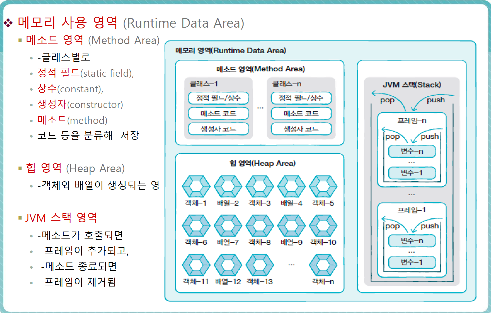

# 참조 타입

* 기본 타입
    - 정수, 실수, 문자, 논리 리터럴 저장

* 참조 타입
    - 객체(object)의 번지를 참조하는 타입
    - 배열, 열거, 클래스, 인터페이스

* 기본 타입 변수와 참조 타입 변수의 차이점

```java

int age = 25;
double price = 100.5;
// 기본타입

String name = "김세환";
String hobby = "독서";
// 참조 타입
```

JVM 메모리에서

스택영역에는   


name : 100
hobby : 200
price : 100.5
age : 25
  
메모리에 이렇게 저장된다고 쳐보자

name과 hobby는 참조타입이므로, 100번지와 200번지라는 힙영역의 메모리 번지를 갖고 있는 것이다.

* 메모리 사용 영역 (Runtime Data Area)
    - 메소드 영역
        - 클래스 별로
        - 정적 필드
        - 상수
        - 생성자
        - 메소드
        - 코드 등을 분류해 저장
    - 힙 영역
        - 객체와 배열이 생성되는 영역
    - JVM 스택 영역
        - 메소드가 호출되면
        - 프레임이 추가되고
        - 메소드가 종료되면
        - 프레임이 제거 됨
        - Push, pop




* 배열, 인덱스, 배열 길이, 배열 선언, 배열 생성, 다차원 배열, 향상된 for문

* 배열
    - 데이터를 연속된 공간에 나열하고 각 데이터에 Index 부여한 자료 구조
    - 같은 타입의 데이터만 저장 할 수 있음
    - 한 번 생성된 배열은 길이를 늘리거나 줄일 수 없음

```java

int sum = 0;
for(int i=0; i<30; i++) {
    sum += score[i]
}

int avg = sum / 30;
```

* 배열 변수 선언

```java
int[] intArray;
double[] doubleArray;
String[] strArray;

int intArray[];
double doubleArray[];
String strArray[];
```

* 참조할 배열 객체 없는 경우 배열 변수는 null 값으로 초기화

`타입[] 변수 = null;`

* 배열 생성
    - 값 목록으로 배열 생성

```java
타입[] 변수 = {값0, 값1, 값2, 값3...};
int[] scores = new int[30];
```

```java
public class AryTest {
    public static void main(String[] argv) {
        String[] names = null;

        names = new String[] {"김세환", "홍경원"};
        System.out.println(names[0]); // 김세환
    }
    
}

```

## main() 메소드의 String[] args 매개변수

- 실행 할 때 명령라인 매개값을 주었을 경우

```java
String[] args = {문자열0, 문자열1, 문자열2 ....};

public static void main(String[] args) {
    //로직
}
```

## 2차원 배열

- 행렬 구조

```java
int[][] scores = new int[2][3];
// 2*3 행렬의 구조

int[][] scores = { {1, 2} , {3 ,4} };
```


- 참조 타입 배열
    - 요소에 값(정수, 실수, 논리값)을 저장하지 않고, 객체의 번지를 가지고 있음

```java
String[] strArray = new String[3];
strArray[0] = "Java";
strArray[1] = "Java";
strArray[2] = new String("Java");

System.out.println(strArray[0] == strArray[1]); //true (같은 객체를 참조)
System.out.println(strArray[0] == strArray[2]); //false (다른 객체를  참조)
System.out.println(strArray[0].equals(strArray[2]) ); //true (문자열이 동일)
```

* 배열 복사
    - for문을 이용해서 요소 하나 하나를 복사
    - System.arraycopy()를 이용해 복사

```java
/*
API

System.arraycopy(Object src, int srcPos, Object dest, int destPos, int length);
*/

String[] oldStrArray = { "java", "array", "copy" };
String[] newStrArray = new String[5];

System.arraycopy(oldStrArray, 0, newStrArray, 0, oldStrArray.length );
```


* 향상된 for문
    - 배열이나 컬렉션을 좀 더 쉽게 처리
    - 반복 실행 위해 루프 카운터 변수나 증감식 사용하지 않음

```java
int[] scores = {1, 2, 3, 4, 5};

int sum = 0;

for(int score : scores) {
    sum = sum + score;
}
System.out.println("점수 총합 = " + sum);
```

## 열거 타입, 열거 타입 선언, 열거 상수, 열거 타입 변수

- 열거 타입
    - 열거 상수(한정된 값)를 저장하는 타입

```java
public enum Week {
    MONDAY,
    TUESDAY,
    WEDNESDAY,
    THURSDAY,
    FRIDAY,
    SATURDAY,
    SUNDAY
}
```

